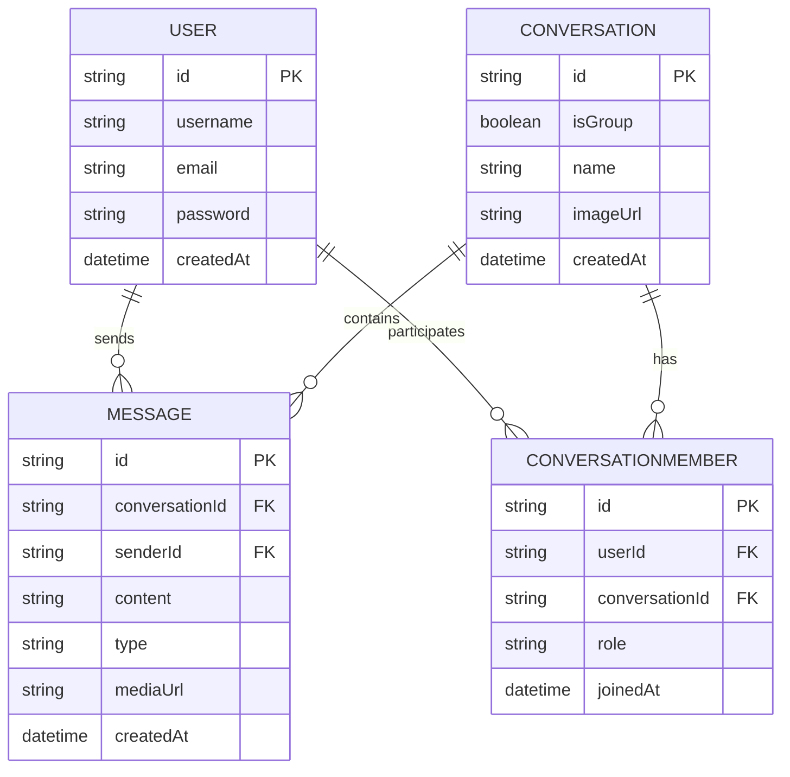

Database preview architecture (this could change):

```mermaid
erDiagram
    USER {
        string id PK
        string username
        string email
        string password
        datetime createdAt
    }

    CONVERSATION {
        string id PK
        boolean isGroup
        string name
        string imageUrl
        datetime createdAt
    }

    CONVERSATIONMEMBER {
        string id PK
        string userId FK
        string conversationId FK
        string role
        datetime joinedAt
    }

    MESSAGE {
        string id PK
        string conversationId FK
        string senderId FK
        string content
        string type
        string mediaUrl
        datetime createdAt
    }

    USER ||--o{ MESSAGE : "sends"
    USER ||--o{ CONVERSATIONMEMBER : "participates"
    CONVERSATION ||--o{ MESSAGE : "contains"
    CONVERSATION ||--o{ CONVERSATIONMEMBER : "has"

```
